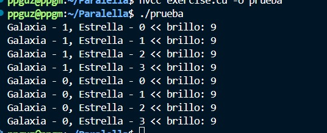
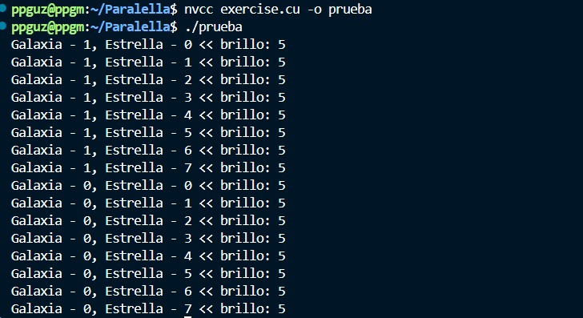
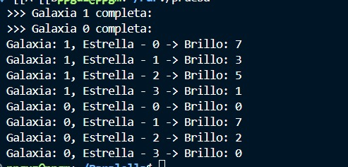
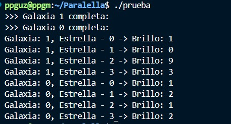

# Laboratorio Final

- Programador principal: Pedro Guzmán
- Analista: Mathew Cordero
- Guía Conceptual: Gustavo Cruz

## Fase 1

### Código Original

```c
#include <stdio.h>
#include <stdlib.h>
#include <time.h>
#include <unistd.h>


__global__ void helloFromGalaxy(int brillo) {
    printf("Galaxia - %d, Estrella - %d << brillo: %d\n",  blockIdx.x,threadIdx.x, brillo);

};


int main() {

  srand(time(NULL)); 
  int numero = rand() % 10;
  helloFromGalaxy<<<2, 4>>>(numero);
  sleep(5);
  cudaDeviceSynchronize();
  return 0;

}
```

### Ejecución del código



1. ¿Qué relación existe entre blockIdx.x y el número de galaxia impreso?
BlockIdx tiene el mismo numero que las galaxias impresas.

2. ¿Qué representa threadIdx.x dentro de tu simulación?
Es la estrella.

3. Si duplicas la cantidad de estrellas, ¿cambia el orden de impresión o solo el tamaño de la salida?
No cambio el orden, solo aumento el tamaño de la salida.



4. ¿Qué representa el “brillo” dentro de este modelo paralelo?
Un dígito aleatorio.

## Fase 2

### Código
```c
#include <stdio.h>
#include <stdlib.h>
#include <time.h>
#include <cuda_runtime.h>
#include <curand_kernel.h>

#define RANGE 10

__global__ void setup_kernel(curandState *state, unsigned long long seed) {
    int idx = blockIdx.x * blockDim.x + threadIdx.x;
    curand_init(seed, idx, 0, &state[idx]);
}

__global__ void helloFromGalaxy(curandState *state) {
    int idx = blockIdx.x * blockDim.x + threadIdx.x;

    float uniform_float = curand_uniform(&state[idx]);

    int random_int = (int)(uniform_float * (RANGE + 1));
    if (random_int > RANGE) random_int = RANGE;  


    if (threadIdx.x == 0) {
        printf(">>> Galaxia %d completa:\n", blockIdx.x);
    };
     __syncthreads();
    
    printf("Galaxia: %d, Estrella - %d -> Brillo: %d\n", blockIdx.x, threadIdx.x, random_int);

}

int main() {

    srand(time(NULL)); 
    
    int numBlocks = 2;
    int threadsPerBlock = 4;
    int totalThreads = numBlocks * threadsPerBlock;

    curandState *d_state;
    cudaMalloc(&d_state, totalThreads * sizeof(curandState));

    unsigned long long seed = time(NULL);
    setup_kernel<<<numBlocks, threadsPerBlock>>>(d_state, seed);
    cudaDeviceSynchronize();

    helloFromGalaxy<<<numBlocks, threadsPerBlock>>>(d_state);
    cudaDeviceSynchronize();
    cudaFree(d_state);
    
    return 0;
}
```

### Con sync


### Sin sync


1. ¿Qué ocurre si eliminas la sincronización?
Cada hilo imprime su valor, pero los hilos no esperan a que el anterior termine y se mezclan los prints.

2. ¿Qué significa que “__ syncthreads() solo sincroniza dentro de un bloque”?

Qué solo va a sincronizcar lo que está dentro de la misma galaxia, y dentro de esa galaxia todos los hilos deben terminar la instrucción para poder continuar.

3. ¿Por qué la sincronización entre galaxias (bloques diferentes) no es posible directamente?
Porque cada bloque es independiente y parelo, pero no tienen un mecanismo global que los sincronize, mientras que los hilos dentro de un bloque si pueden coordinarse  sincronizarse entre sí.

4. ¿Qué tipo de errores podrían aparecer si las estrellas imprimen sin coordinarse?
Se desordenan e imprimen salidas entre galaxias. Y puede ocurrir el clásico race conditions. 

## Fase 3

1. ¿Por qué es útil la memoria compartida en este contexto?
Como permite que todos los hilos accedan a la memoria sin ir al global, se hace más rápido el proceso.

2. ¿Qué ventaja tiene frente al uso de memoria global?
Cómo se mencionó antes, en bloques la comunicación entre hilos se puede dar de forma más rápida y eficiente, además que reduce el tráfico en la memoria global.

3. ¿Qué pasaría si más de una estrella intenta escribir al mismo tiempo en la misma posición?
Si hay coordinación, no habría problema, probablemente quién llega primero escribe y el siguiente busca otra dirección de memoria, sin coordinación, una race condition.

4. ¿Qué refleja el promedio del brillo respecto al comportamiento de la GPU?

## Fase 4

Gustavo Cruz:


1. ¿Qué aprendiste sobre cómo CUDA distribuye el trabajo entre hilos y bloques?
Cuda distribuye el trabajo en bloques e hilos, y cada bloque puede contener varios hilos que ejecutan el mismo kernel en paralelo, los bloques son independientes y estos bloques se reparten entre los cores de la GPU para correr el programa.

2. ¿Qué fue lo más difícil de entender del paralelismo?
Como aplicar correctamente las funciones de paralelización, pues muchas veces menos es más y en paralelización se nota bastante, no siempre un código lleno de directivas de paralelización va a correr mejor que uno simple. Además que tener una estrategia previa de paralelización ayuda bastante a mitigar esto. También me costo aprender la coordinación de los threads.

3. Si pudieras mejorar el laboratorio, ¿qué cambio harías en el algoritmo?
Cargar los bloques en CPU en lugar del GPU para que se impriman bien.

4. ¿Qué analogía del mundo real usarías para explicar el concepto de “sincronización de hilos”?
El trabajo de los meseros en un restaurante: varios pueden estar atendiendo distintas mesas al mismo tiempo, pero cuando una mesa específica hace un pedido, solo un mesero la atiende mientras los demás esperan su turno o atienden otras mesas.

5. ¿Cómo verificarías que realmente se está ejecutando en GPU y no en CPU?
Como uso linux, revisaría si el proceso aparece en nvidia-smi que es un programa que viene con los drivers de nvidia  te muestre que procesos ejecuta la gpu

Mathew Cordero:

1. ¿Qué aprendiste sobre cómo CUDA distribuye el trabajo entre hilos y bloques?

2. ¿Qué fue lo más difícil de entender del paralelismo?

3. Si pudieras mejorar el laboratorio, ¿qué cambio harías en el algoritmo?

4. ¿Qué analogía del mundo real usarías para explicar el concepto de “sincronización de hilos”?

5. ¿Cómo verificarías que realmente se está ejecutando en GPU y no en CPU?

Pedro Guzmán:

1. ¿Qué aprendiste sobre cómo CUDA distribuye el trabajo entre hilos y bloques?

R// Aprendí que cada bloque es como una unidad de procesamiento y dentro de esta el trabajo se puede dividir en hilos. 

2. ¿Qué fue lo más difícil de entender del paralelismo?

R// Para mí la sincronización pues es bastante complejo y confuso entender como evitar que haya condiciones de carrera y que hacer para que los hilos esperen a los demás para terminar su ejecución. 

3. Si pudieras mejorar el laboratorio, ¿qué cambio harías en el algoritmo?

R//  Para mí el algoritmo es bastante bueno aunque buscaría alguna forma de que la generación de números aleatorios fuera más sencilla. 

4. ¿Qué analogía del mundo real usarías para explicar el concepto de “sincronización de hilos”?

R// Una carrera de relevos, los competidores deben esperar a sus demás compañeros para seguir en la carrera. 

5. ¿Cómo verificarías que realmente se está ejecutando en GPU y no en CPU?

R// Usar el comand nvidiasmi mientras se ejecuta el programa, este programa indica características de la GPU como el consumo de energía, memoria, etc. Si al ejecutarlo la firma es parecida a una firma en donde se ejecuta un programa entonces podemos concluir que estamos en el GPU, si no posiblemente este en el CPU. 

